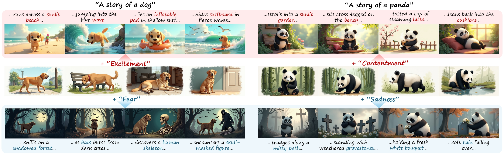
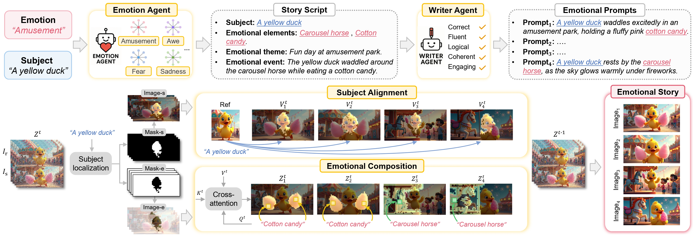
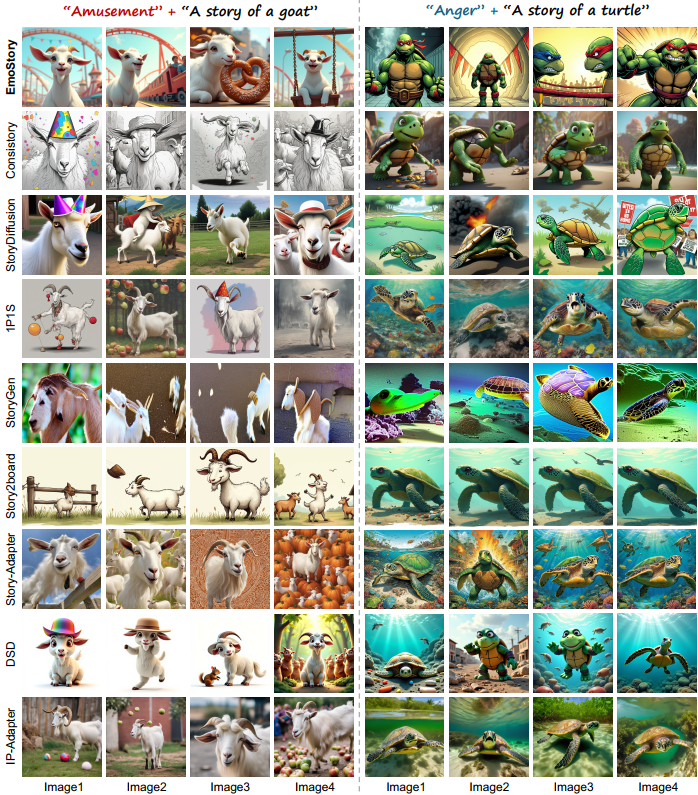
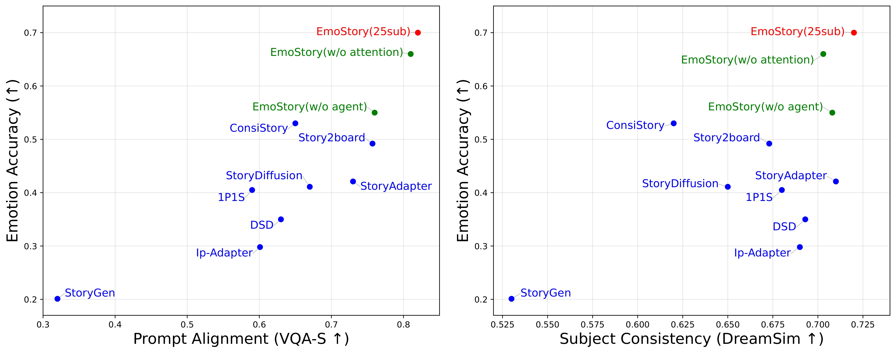

# EmoStory: Emotion-Aware Story Generation
> [Jingyuan Yang](https://jingyuanyy.github.io/), Rucong Chen, Weibin Luo, [Hui Huang](https://vcc.tech/~huihuang)<sup>*</sup>  
> Shenzhen University<br>
> Emotion-aware Story Generation aims to generate subject-consistent visual stories with explicit emotional directions. This task is challenging due to the abstract nature of emotions, which must be grounded in concrete visual elements and consistently expressed across a narrative through visual composition.

<a href="https://arxiv.org/abs/2603.10349"></a>

<p align="left">
  
<br>
Fig 1. Emotion-aware story generation with EmoStory, which introduces emotions (top: positive, bottom: negative) to given subjects (middle: neutral), generating coherent and emotionally expressive visual stories.
</p>


## Quick Start

### Requirements

```bash
# 1) Clone the repository
git clone https://github.com/JingyuanYY/EmoStory.git
cd EmoStory

# 2) Create and activate env
conda create -n emostory python=3.12
conda activate emostory

# 3) Install the compatible torch version
# https://pytorch.org/get-started/previous-versions/
# CUDA 12.4
pip install torch==2.6.0 torchvision==0.21.0 torchaudio==2.6.0 --index-url https://download.pytorch.org/whl/cu124

# 4) Install dependencies
pip install -r requirements.txt
```

> Tip: It is recommended to manually install the larger library by referring to the `req_without_dependence.txt` file, and follow the debug reminder for installation during runtime.

> You can download the baseline models Flux.1-dev from [here](https://huggingface.co/black-forest-labs/FLUX.1-dev) 

---

## EmoStory
<p align="left">
  
<br>
Fig 2. Overview of EmoStory. Agent-based story planning maps abstract emotions to concrete emotional prompts at semantic level, while region-aware story generation preserves subject consistency and enhances emotional expressiveness at pixel level.
</p>

### 1. Agent-based Story Planning

Configure the LLM API interface in `/ask_gpt/Coordinated_Agent.py`, then run the script.

```bash
python ask_gpt/Coordinated_Agent.py
```

Generated story script for eight emotion are written to `/results`.  
We have set up a sample: `/results/EmoStory_Script`

### 2. Region-aware Story Generation

EmoStory has a memory requirement, which can run in parallel on two 24GB GPUs. In the `bash.run.sh`, you can modify the `GPU-PAIRS` to specify GPU usage, and modify `STORY_DIR` to select the script position in `results`.

```bash
bash bash_run.sh
```

Generated story images for eight emotion are written to `/results`.  

---

## Results
### Qualitative Results

<p align="left">
  
<br>
Fig 3. Comparisons with state-of-the-art methods. EmoStory is superior in both emotion evocation and story expressiveness.
</p>

### Quantitative Results
<p align="left">
  
<br>
Fig 4. EmoStory (red) outperforms all compared methods (blue) and ablations (green) across three evaluation metrics.
</p>

## Citation
If you find this work useful, please kindly cite our paper:
```
@misc{yang2026emostoryemotionawarestorygeneration,
      title={EmoStory: Emotion-Aware Story Generation}, 
      author={Jingyuan Yang and Rucong Chen and Hui Huang},
      year={2026},
      eprint={2603.10349},
      archivePrefix={arXiv},
      primaryClass={cs.CV},
      url={https://arxiv.org/abs/2603.10349}, 
}
```